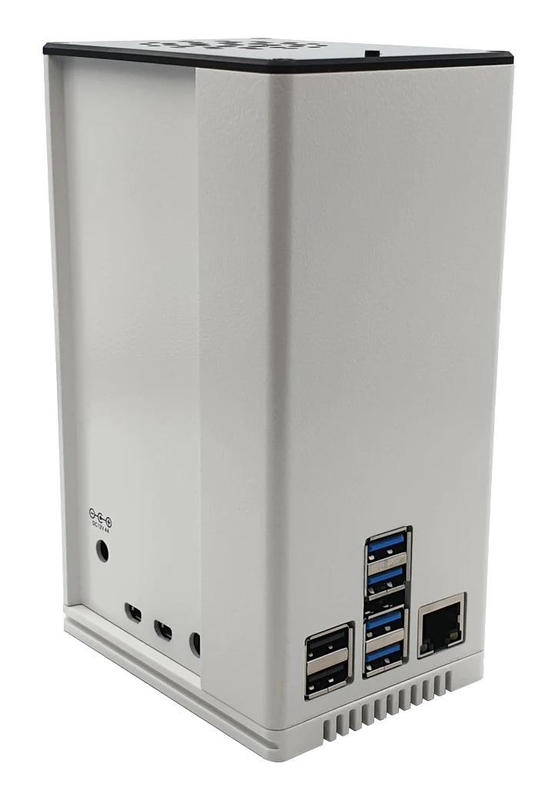

<div align="center">
    <h1>
        Homelab Automation - Still a work in progress!
    </h1>
    <p align="center">
        All scripts used to automate the setup of my homelab 
        <br/>
        <strong>·</strong>
        <a href="https://github.com/AntonVanAssche/homelab-automation/issues">Report Bug</a>
        <strong>·</strong>
        <a href="https://github.com/AntonVanAssche/homelab-automation/issues">Request Feature</a>
   </p>
</div>

## About The Project


The Homelab Project is a personal endeavor to create a small-scale, self-hosted infrastructure using two Raspberry Pi 4B devices.
The project consists of two servers, named Homer and Marge, each serving different purposes within the homelab environment.
Both servers run Debian Bullseye and are completely automated using Bash scripts.
The script will install and configure things like SELinux, firewalld, Podman and server specific applications.

## Encountered Issues

Originally, I was planning on using a RHEL-based distribution for the servers, such as Oracle Linux 9 or Fedora Server 38.
But due to the lack of support for the Raxda Rock Pi SATA HAT, I had to switch to Debian Bullseye.
I tried to get the SATA HAT working on Fedora Server 38, but I couldn't get it to work.
Therefore, I had to switch to Debian Bullseye, which is a Debian-based distribution.

## Server: Homer

Homer serves primarily as a hometheater media server, hosting an Emby instance to provide media streaming capabilities. Emby is a media server application that allows for the streaming of media files to a wide range of devices.

Besides Emby, Homer also hosts a transmission-daemon instance to enable torrenting capabilities. Transmission is a BitTorrent client that allows for the downloading and seeding of torrent files. It is configured to use a VPN connection to ensure that all torrent traffic is encrypted and secure.

Probably the most important feature of Homer is the Grafana instance that is hosted on it. Allowing me to monitor both Homer and Marge from a web interface. Both servers are monitored using Prometheus and Node Exporter. Dashboards are created using Grafana's API and are automatically provisioned using the provisioning script.

## Server: Marge



Marge is a dedicated Network-Attached Storage (NAS) server configured with a RAID 5 array using four SATA HDDs. It offers reliable data storage and access within the homelab environment. Samba, an open-source implementation of the Server Message Block (SMB) protocol, is installed on Marge to enable seamless file sharing and network integration.

In a typical Raspberry Pi setup, connecting SATA devices directly is not possible. However, with the help of the Raxda Rock Pi SATA HAT, Marge overcomes this limitation. The SATA HAT allows for the connection of up to four SATA devices to a single Raspberry Pi. It achieves this by utilizing the GPIO pins and USB 3 buses on the Raspberry Pi, enabling the SATA devices to be connected to the SATA HAT via its SATA ports.

By leveraging the power of Samba, Marge enables seamless access and interaction with the stored data from other devices on the network. Computers running Windows, macOS, or Linux can effortlessly connect to Marge and take advantage of the SMB protocol's compatibility and interoperability features. This allows for efficient file transfers, sharing, and collaborative workflows, regardless of the operating system being used.

Besides Samba, Marge also hosts a Pihole instance to provide network-wide ad-blocking capabilities. Pihole is a DNS sinkhole that blocks advertisements and trackers at the network level. Marge also provides a WireGuard VPN server to enable secure remote access to the homelab environment from anywhere in the world.

## Setup Guide

### Prerequisites

Depending on the server you want to set up, different environment variables need to be added to the `.env` file.
This file must be placed in the `provisioning` directory.

#### Homer

Homer requires the following environment variables to be set:

```bash
# Network configuration
NETWORK_INTERFACE=                      # e.g. "Wired connection 1"
HOMER_IP_ADDRESS=                       # e.g. "192.168.0.2"
MARGE_IP_ADDRESS=                       # e.g. "192.168.0.3"
SUBNET_MASK_CIDR=                       # e.g. "24"
DEFAULT_GATEWAY=                        # e.g. "192.168.0.1"
DNS_SERVER=                             # e.g. "1.1.1.1"

# Host configuration
HOST_NAME=                              # "homer" or "marge"

# Timezone configuration
TIMEZONE=                               # e.g. "Europe/Brussels"

# Server configuration
SERVER_DOMAIN=                          # e.g. "awesome-homelab.com"

# Grafana contact point
DISCORD_WEBHOOK_URL=                    # e.g. "https://discord.com/api/webhooks/..."
```

#### Marge

Marge requires the following environment variables to be set:

```bash
# Network configuration
NETWORK_INTERFACE=                      # e.g. "Wired connection 1"
HOMER_IP_ADDRESS=                       # e.g. "192.168.0.2"
MARGE_IP_ADDRESS=                       # e.g. "192.168.0.3"
SUBNET_MASK_CIDR=                       # e.g. "24"
DEFAULT_GATEWAY=                        # e.g. "192.168.0.1"
DNS_SERVER=                             # e.g. "1.1.1.1"

# Host configuration
HOST_NAME=                              # "homer" or "marge"

# Timezone configuration
TIMEZONE=                               # e.g. "Europe/Brussels"

# Pi-hole configuration
PIHOLE_PASSWORD=                        # e.g. "password"

# WireGuard configuration
PUBLIC_IP_ADDRESS=                      # e.g. "209.141.217.63" (https://www.whatismyip.com/)
```

### Installation

To install the server, navigate to the `provisioning` directory and run the `init.sh` script.

#### Homer

```console
# cd provisioning
# ./init.sh
```

**Note:** The script **must** be run as root (`sudo -i`).

#### Marge

In case you want to install Marge, you'll have to run the `install.sh` script located in the `rockpi-sata` directory first.
Simply navigate to the `rockpi-sata` directory and run the `install.sh` script.

```console
# cd rockpi-sata
# ./install.sh
# systemctl reboot
```

After the installation of the SATA HAT, navigate back to the `provisioning` directory and run the `init.sh` script.

```console
# cd provisioning
# ./init.sh
```

**Note:** The script **must** be run as root (`sudo -i`).

## Contributing

Feel free to contribute to this repository by submitting pull requests with improvements, bug fixes, or additional server configurations.
Your contributions are highly appreciated!

## License

This project is licensed under the MIT License - see the [LICENSE.md](LICENSE.md) file for details.

## References

-   [Raxda Rock Pi SATA HAT Documentation](https://wiki.radxa.com/Dual_Quad_SATA_HAT)
